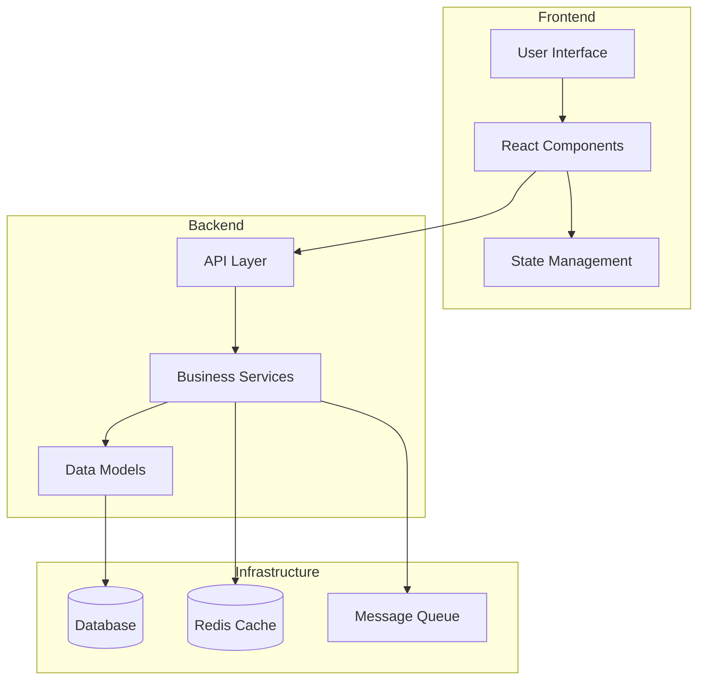
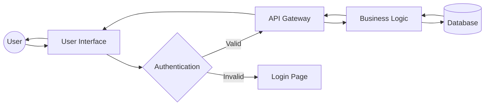
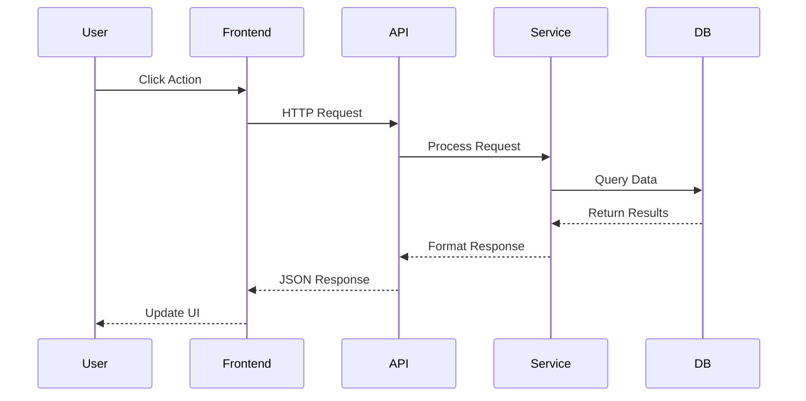
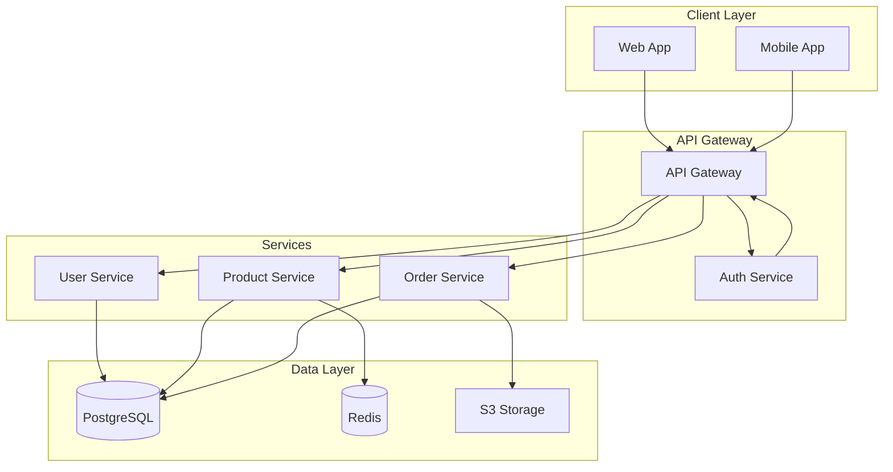
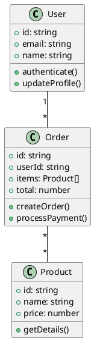
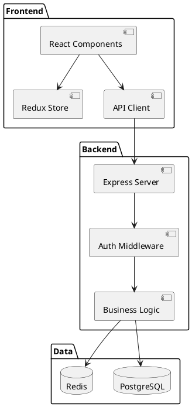
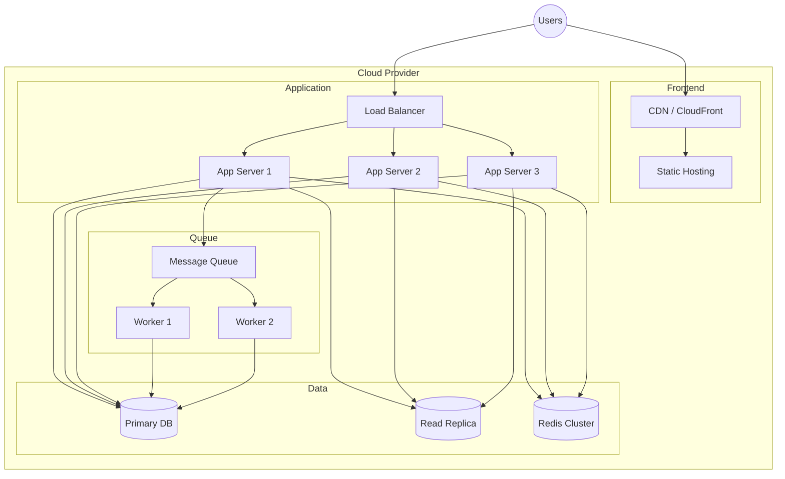

# Architecture Diagram Generator

I'll analyze your codebase and generate visual architecture diagrams showing component relationships, data flow, and system structure.

Arguments: `$ARGUMENTS` - diagram type or format (e.g., "mermaid", "plantuml", "component", "data-flow")

## Strategic Analysis Process

<think>
Effective architecture diagrams require understanding:

1. **Project Structure Analysis**
   - What's the application architecture? (monolith, microservices, serverless)
   - What layers exist? (frontend, backend, database, services)
   - How do components communicate?
   - What are the major modules and their responsibilities?
   - Are there clear architectural patterns? (MVC, MVVM, Clean Architecture)

2. **Diagram Type Selection**
   - Component diagram: Show major components and relationships
   - Sequence diagram: Show interaction flows
   - Data flow diagram: Show how data moves through system
   - Deployment diagram: Show infrastructure and deployment
   - Class diagram: Show object-oriented structure
   - Entity-relationship: Show database schema

3. **Format Decision**
   - Mermaid: Simple, version-controllable, GitHub/GitLab rendering
   - PlantUML: More features, complex diagrams, requires rendering
   - Diagrams.net (Draw.io): Visual editing, XML format
   - ASCII art: Terminal-friendly, simple visualizations

4. **Detail Level**
   - High-level overview: Major components only
   - Medium detail: Components + key interactions
   - Detailed: All modules, functions, data flows
   - Focus on what's most valuable for documentation
</think>

## Phase 1: Architecture Discovery

**MANDATORY FIRST STEPS:**
1. Analyze project structure and file organization
2. Identify architectural patterns from code
3. Map component dependencies
4. Detect technology stack and frameworks

Let me analyze your project architecture:

```bash
# Analyze project structure
echo "=== Architecture Analysis ==="

# Detect project type
if [ -d "src/components" ] || [ -d "components" ]; then
    echo "Frontend components detected"
fi

if [ -d "src/api" ] || [ -d "api" ] || [ -d "routes" ]; then
    echo "API/Backend layer detected"
fi

if [ -d "src/models" ] || [ -d "models" ]; then
    echo "Data models detected"
fi

if [ -d "src/services" ] || [ -d "services" ]; then
    echo "Service layer detected"
fi

# Count major components
echo ""
echo "Component counts:"
find src -type f -name "*.js" -o -name "*.ts" -o -name "*.jsx" -o -name "*.tsx" 2>/dev/null | wc -l | xargs echo "Files:"
find src -type d -maxdepth 2 2>/dev/null | wc -l | xargs echo "Directories:"

# Identify framework
if grep -q "\"next\"" package.json 2>/dev/null; then
    echo "Framework: Next.js"
elif grep -q "\"react\"" package.json 2>/dev/null; then
    echo "Framework: React"
elif grep -q "\"vue\"" package.json 2>/dev/null; then
    echo "Framework: Vue"
elif grep -q "\"express\"" package.json 2>/dev/null; then
    echo "Framework: Express (Node.js)"
fi
```

## Phase 2: Component Relationship Mapping

I'll map relationships between components:

**Analysis Methods:**
- Import/export analysis (module dependencies)
- API endpoint mapping (request/response flows)
- Database relationship detection (foreign keys, relations)
- Event system mapping (event emitters/listeners)
- Service dependencies (dependency injection patterns)

**Using Native Tools:**
- **Grep** to find import statements and dependencies
- **Glob** to identify component files by pattern
- **Read** key architectural files (routers, services, models)
- Pattern detection for architectural styles

I'll analyze:
- Frontend component hierarchy
- Backend route handlers and middleware
- Service layer dependencies
- Database entity relationships
- External API integrations

## Phase 3: Diagram Generation

Based on analysis, I'll generate appropriate diagrams:

### Mermaid Diagrams (Default)

**Component Diagram:**


**Data Flow Diagram:**


**Sequence Diagram:**


**System Architecture:**


### PlantUML Diagrams

**Class Diagram:**


**Component Diagram:**


### Deployment Diagram

**Infrastructure Visualization:**


## Phase 4: Diagram Output

I'll create diagram files in your project:

**File Creation:**
- `docs/architecture/components.mmd` - Component diagram
- `docs/architecture/data-flow.mmd` - Data flow diagram
- `docs/architecture/deployment.mmd` - Deployment diagram
- `docs/architecture/sequence.mmd` - Sequence diagrams
- `docs/architecture/README.md` - Documentation with rendered diagrams

**Markdown Integration:**
```markdown
# System Architecture

## Component Diagram

```mermaid
[diagram content]
```

## Data Flow

```mermaid
[diagram content]
```

This automatically renders on GitHub, GitLab, and many documentation platforms.
```

## Token Optimization

**Expected range**: 1,400–4,200 tokens (initial), 500 tokens (cache hit)

**Caching**: Caches architecture analysis in `.claude/cache/architecture/` for 7 days. Invalidated when source structure changes.

**Early exit**: Returns cached diagram immediately if project structure has not changed.

**Patterns used**: Grep-before-Read, early exit, caching, Bash for system queries
